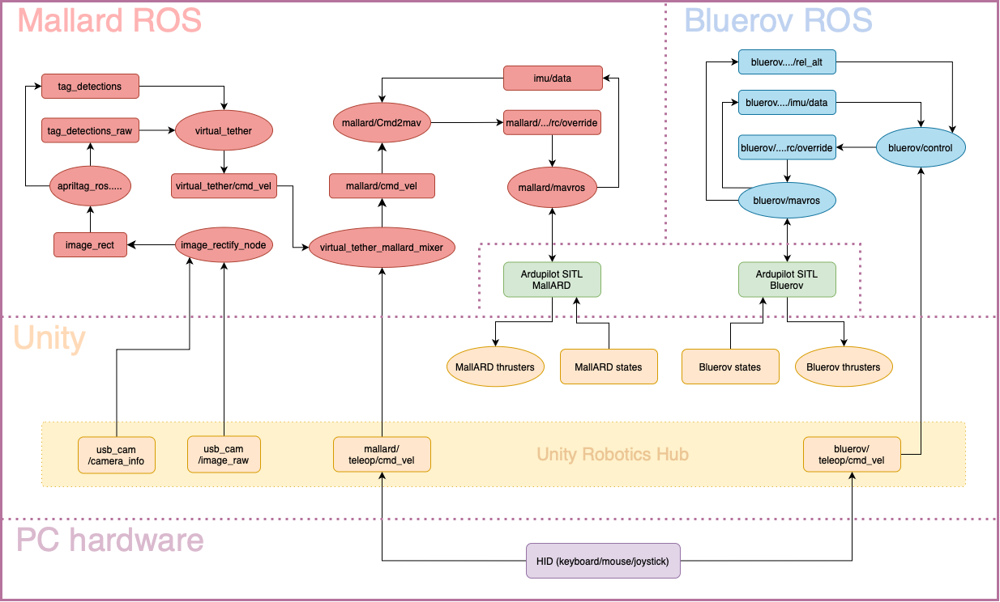

# ore_unity_meta



## Installation and Use
### ROS
Download the [install_ros.sh](scripts/install_ros.sh) script and execute it from terminal:
```shell
wget https://raw.githubusercontent.com/mavlink/mavros/refs/heads/master/mavros/scripts/install_geographiclib_datasets.sh
chmod +x install_ros.sh
./install_ros.sh
```
Once the script finishes, you should be able to launch the ros packages from the same terminal:
```
roslaunch taarn_mallard_onboard mallard_onboard.launch
roslaunch taarn_bluerov_onboard bluerov_onboard.launch
```

### Ardupilot SITL
See [ARDUPILOT_SITL.md](ARDUPILOT_SITL.md)


## List of repositories

#### Mallard
- [taarn_mallard_onboard](https://github.com/ICE9-Robotics/taarn_mallard_onboard/tree/unity) unity branch
- [MallARD](https://github.com/ICE9-Robotics/MallARD/tree/ice9-dev) ice9-dev branch
- [visual_virtual_tether](https://github.com/ICE9-Robotics/visual_virtual_tether/tree/unity) unity branch

#### Bluerov
- [taarn_bluerov_onboard](https://github.com/ICE9-Robotics/taarn_bluerov_onboard/tree/unity) unity branch
- [taarn_bluerov](https://github.com/ICE9-Robotics/taarn_bluerov)

#### Ardupilot
- [taarn_ardupilot](https://github.com/ICE9-Robotics/taarn_ardupilot)
