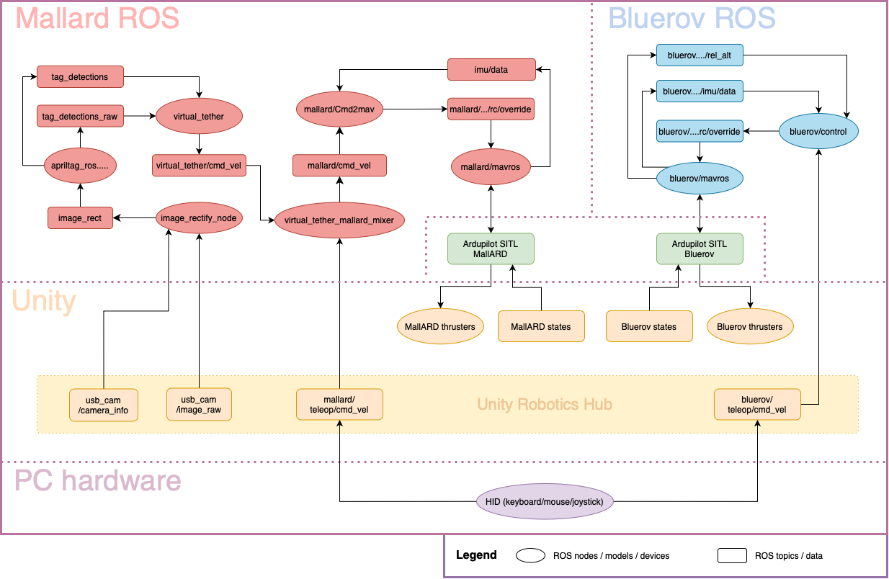

# ore_unity_meta

## Mallard
### Repositories
- [taarn_mallard_onboard](https://github.com/ICE9-Robotics/taarn_mallard_onboard/tree/unity) unity branch
- [MallARD](https://github.com/ICE9-Robotics/MallARD/tree/ice9-dev) ice9-dev branch
- [visual_virtual_tether](https://github.com/ICE9-Robotics/visual_virtual_tether/tree/unity) unity branch

### Installation instructions
See [MALLARD_INS.md](MALLARD_INS.md)

## Bluerov
### Repositories
- [taarn_bluerov_onboard](https://github.com/ICE9-Robotics/taarn_bluerov_onboard/tree/unity) unity branch
- [taarn_bluerov](https://github.com/ICE9-Robotics/taarn_bluerov)

### Installation instructions
See [BLUEROV_INS.md](BLUEROV_INS.md)
